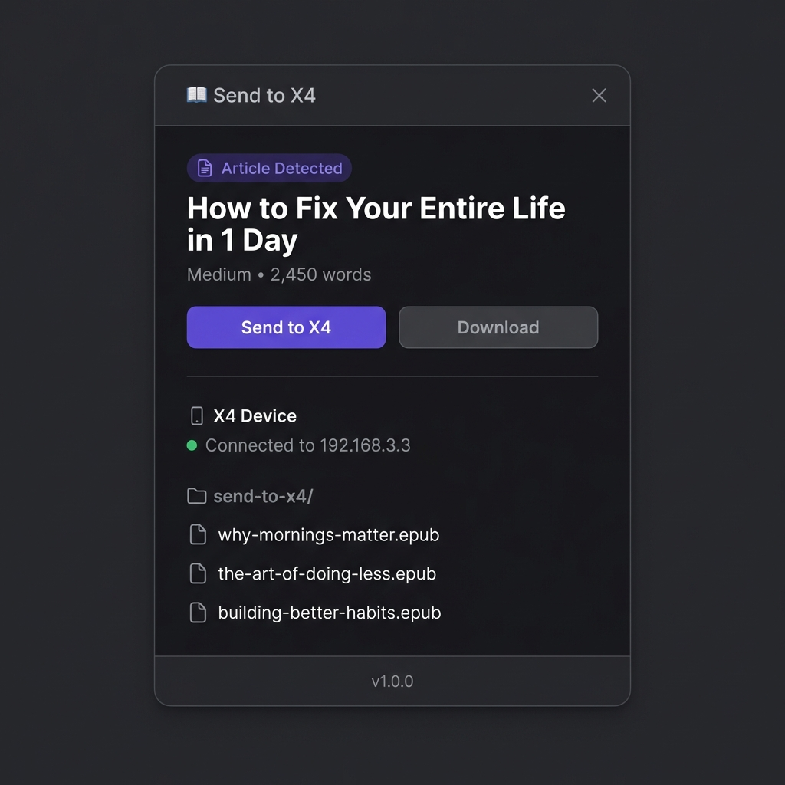
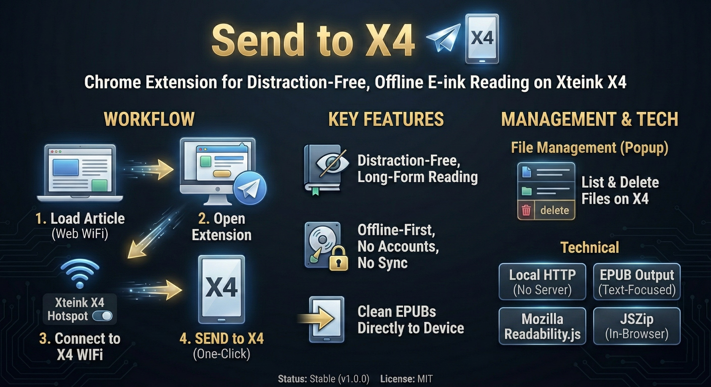
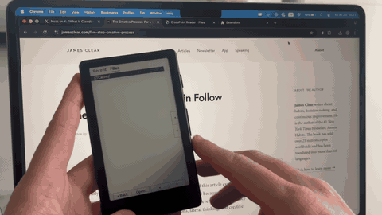

# Send to X4

A browser extension to send long-form articles from the web directly to your **Xteink X4** e-ink reader as clean EPUB files.

> Status: **Stable (v1.1.1)** — Tested with Xteink X4
>
> Supports: **Chrome** • **Firefox** • **Edge**

  

  

---

## What is this?

**Send to X4** is a small, offline-first utility that helps you move reading-focused content from the web to your Xteink X4 with minimal friction.

It is designed for people who:
- prefer reading on e-ink
- want distraction-free, offline reading
- don't want accounts, sync services, or cloud storage

---

## Features
  
  - 📤 **Send to X4** — One-click conversion and upload to your Xteink X4
  - 📖 **Long-form article support** — Optimized for reading-oriented pages
  - 🧵 **Twitter/X Thread Support** — Captures full threads (original author only) and "Long Posts"
  - 🤖 **CrossPoint Firmware Ready** — Supports both Stock and CrossPoint firmware with custom IPs
  - 💾 **Offline-first & local** — No accounts, no servers, no tracking
  - 📥 **EPUB download fallback** — Keep a local copy if needed
  - 🗂️ **Advanced File Management** — View, sort, and delete files directly on the device
  
  ---
  
  ## Installation
  
  1. Open Chrome and go to `chrome://extensions/`
  2. Enable **Developer mode** (toggle in the top-right corner)
  3. Click **Load unpacked**
  4. Select the `send-to-x4` folder
  5. Pin the extension for easy access
  
  ---
  
  ## Usage
  
  ### Sending an Article
  
  1. **Load the article**  
     Open a long-form article, reading-focused page, or Twitter thread while connected to the internet.
  
  2. **Connect to X4**  
     Switch your computer's WiFi to the Xteink X4 hotspot.
  
  3. **Open the extension**  
     Click the **Send to X4** icon in the Chrome toolbar.
  
  4. **Send**  
     Click **Send to X4** to upload the EPUB, or **Download** to save it locally.
  
  ### Managing Device Files
  
  The extension now provides a full file manager for your X4:
  - **View All Files**: Scrollable list of content on the device.
  - **Sort**: Organize by **Date (Newest/Oldest)** or **Name (A-Z)**.
  - **Delete**: Remove old files to free up space.
  
  ---
  
  ## Twitter/X Support
  
  Send to X4 has specialized logic for X.com:
  - **Smart Thread Extractor**: Automatically detects threads and stitches together tweets from the *original author only*, filtering out noise.
  - **Twitter Articles**: Full support for "Long Posts" / Notes.
  - **Clean Output**: Formatted specifically for e-ink readability.
  
  ---
  
  ## Workflow (Important)
  
  Send to X4 works best as a simple two-step ritual:
  
  1. ✅ Load the article while connected to the internet  
  2. ✅ Switch to the X4 WiFi hotspot  
  3. ✅ Open the popup and send  
  4. ❌ Do not refresh the page while connected to the X4 hotspot
  
  ---
  
  ## Technical Details
  
  - **Chrome Extension**: Manifest V3
  - **Permissions**: `scripting`, `activeTab`, `downloads`, `tabs`, `storage`
  - **Host Permissions**: `<all_urls>` (for images/updates), `http://192.168.3.3/*`, `http://192.168.4.1/*`
  - **Article extraction**: Mozilla Readability.js + Custom Twitter Extractor
  - **EPUB generation**: JSZip (in-browser) + XHTML Validation
  - **Firmware Support**: Stock (192.168.3.3) & CrossPoint (192.168.4.1) + Custom IPs
  
  ---
  
  ## EPUB Output
  
  - **Filename**: `Title - Author - Source - Date.epub`
  - **Location on X4**: `/send-to-x4/`
  - **Content**: Clean XHTML with metadata (Title, Author, Source URL)
  - **Images**: Disabled by default for X4 compatibility (codebase supports it)
  
  ---
  
  ## Troubleshooting
  
  ### "No article detected"
  - The page must contain enough long-form text
  - Try waiting a few seconds for dynamic pages to load
  - Some highly dynamic sites may not extract well
  
  ### "Not connected to X4"
  - Make sure you are connected to the X4 WiFi hotspot
  - Check your **Settings** block in the popup to ensure the **IP Address** matches your device or firmware type.
  - Open the device IP (e.g., `http://192.168.4.1/`) in your browser to verify connectivity.
  
  ### "Extension context invalidated"
  - Reload the extension from `chrome://extensions/`
  - Reload the article page while on internet WiFi
  - Switch back to the X4 hotspot and try again
  
  ---
  
  ## Known Limitations
  
  - Text-only (images are temporarily disabled)
  - Requires manual WiFi switching
  - Works best on long-form, reading-oriented pages
  - Not a read-later service or cloud sync tool

---

## Installation

### Chrome / Edge

1. Open Chrome/Edge and go to `chrome://extensions/` or `edge://extensions/`
2. Enable **Developer mode** (toggle in the top-right corner)
3. Click **Load unpacked**
4. Select the `send-to-x4` folder
5. Pin the extension for easy access

### Firefox Desktop

1. Open Firefox and go to `about:debugging#/runtime/this-firefox`
2. Click **Load Temporary Add-on**
3. Navigate to the `send-to-x4` folder and select `manifest.json`
4. The extension will remain loaded until you restart Firefox

---

## Acknowledgements

- **[borisfaure](https://github.com/borisfaure)** — For implementing CrossPoint firmware support ([PR #2](https://github.com/Xatpy/send-to-x4/pull/2))

---

## License

MIT

---

## Legacy / History

Archive of previous versions and demonstrations.

### v1.0 (Original Release)

